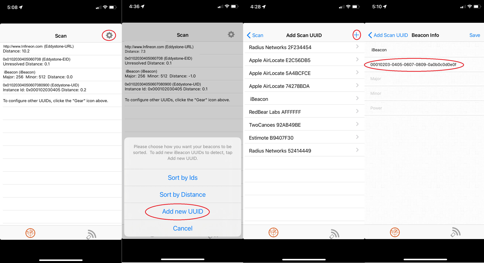
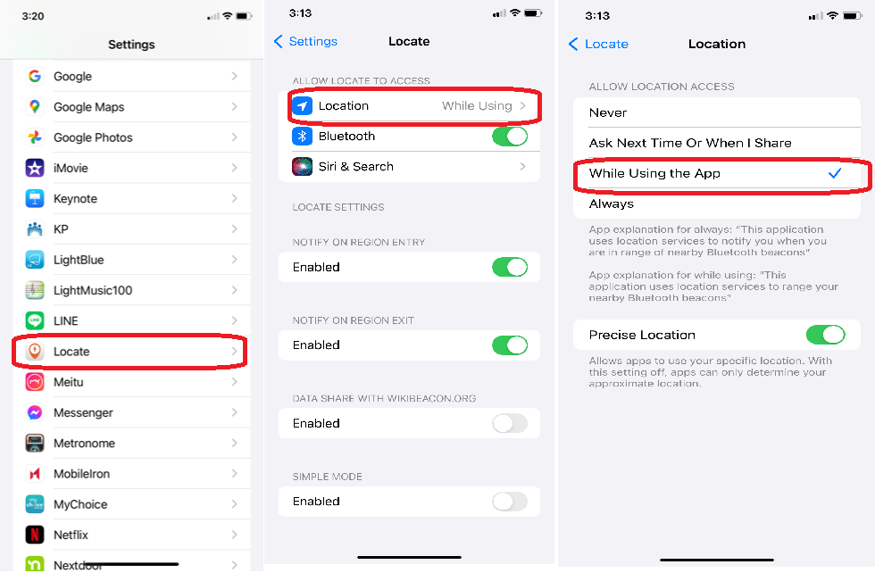
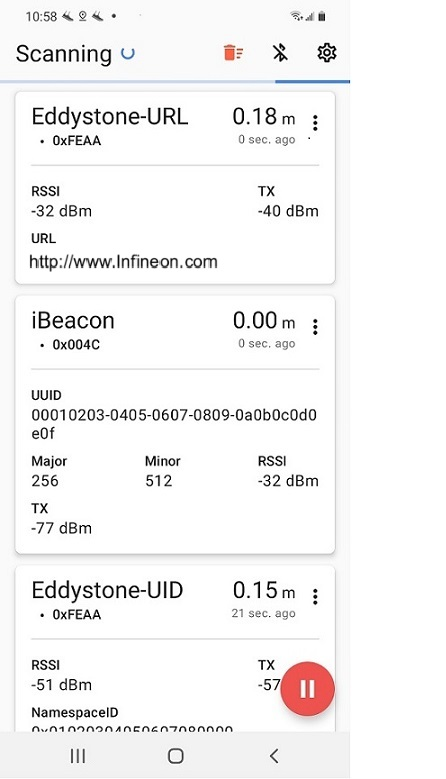
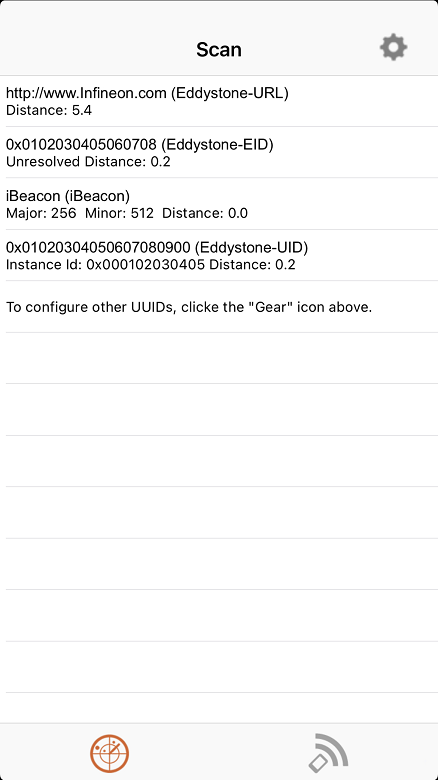
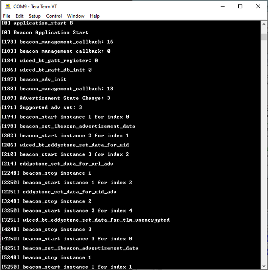
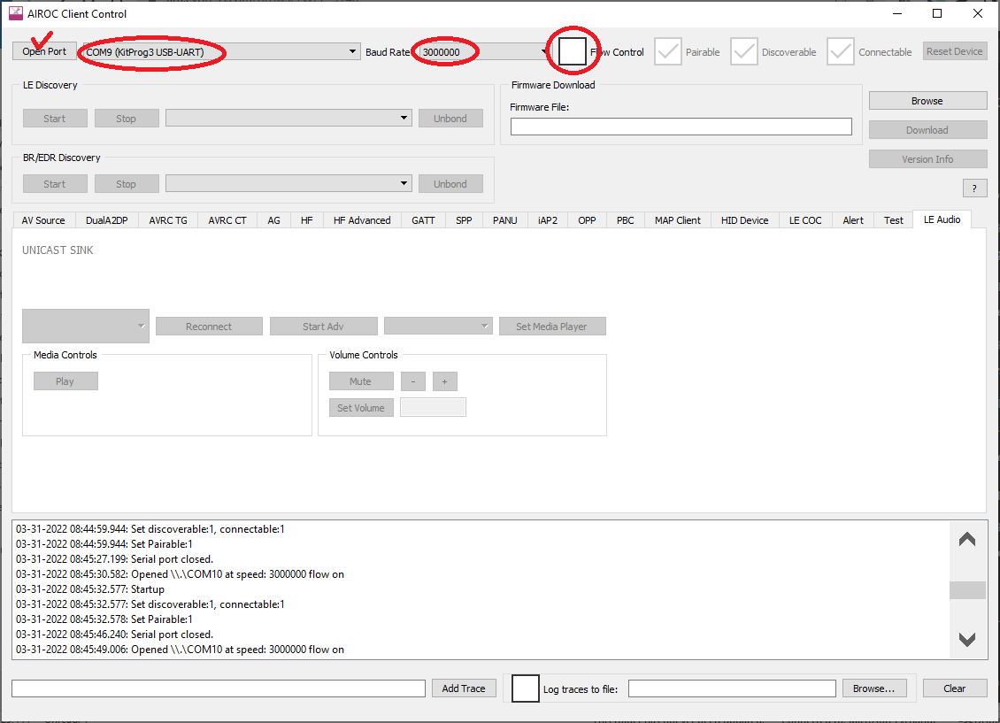
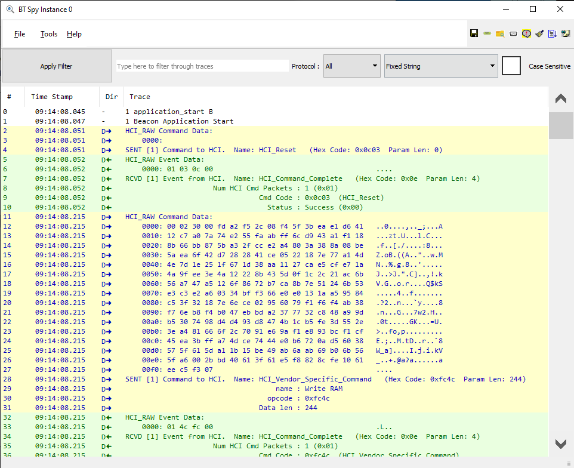

# BTSTACK: Bluetooth&reg; LE Extended Advertisement Beacon

This code example demonstrates the implementation of Bluetooth&reg; LE extended advertisements and the use of the beacon library.

[View this README on GitHub.](https://github.com/Infineon/mtb-example-btstack-freertos-extadv-beacon)

[Provide feedback on this code example.](https://yourvoice.infineon.com/jfe/form/SV_1NTns53sK2yiljn?Q_EED=eyJVbmlxdWUgRG9jIElkIjoiQ0UyMzUwMzgiLCJTcGVjIE51bWJlciI6IjAwMi0zNTAzOCIsIkRvYyBUaXRsZSI6IkJUU1RBQ0s6IEJsdWV0b290aCZyZWc7IExFIEV4dGVuZGVkIEFkdmVydGlzZW1lbnQgQmVhY29uIiwicmlkIjoidGFrLnRvbWl0YUBpbmZpbmVvbi5jb20iLCJEb2MgdmVyc2lvbiI6IjQuMC4wIiwiRG9jIExhbmd1YWdlIjoiRW5nbGlzaCIsIkRvYyBEaXZpc2lvbiI6Ik1DRCIsIkRvYyBCVSI6IklDVyIsIkRvYyBGYW1pbHkiOiJCVEFCTEUifQ==)

## Requirements

- [ModusToolbox&trade; software](https://www.infineon.com/modustoolbox) v3.2
- Board support package (BSP) minimum required version for:
   - CYW920829M2EVK-02 : v2.0.0
   - CYW989829M2EVB-01 : v2.0.0
- Programming language: C
- Associated parts: [AIROC&trade; CYW20829 Bluetooth&reg; LE SoC](https://www.infineon.com/cms/en/product/promopages/airoc20829/)

## Supported toolchains (make variable 'TOOLCHAIN')

- GNU Arm&reg; Embedded Compiler  v10.3.1 (`GCC_ARM`) - Default value of `TOOLCHAIN`
- Arm&reg; Compiler v6.16 (`ARM`)
- IAR C/C++ Compiler v9.30.1 (`IAR`)


## Supported kits (make variable 'TARGET')

- [AIROC&trade; CYW20829 Bluetooth® LE evaluation kit](https://www.infineon.com/CYW920829M2EVK-02) (`CYW920829M2EVK-02`) - Default value of `TARGET`
- AIROC&trade; CYW89829 Bluetooth® LE evaluation kit (`CYW989829M2EVB-01`)

## Hardware setup

This example uses the kit's default configuration. See the respective kit guide to ensure that the kit is configured correctly.

## Software setup

1. Install a terminal emulator if you don't have one. Instructions in this document use [Tera Term](https://ttssh2.osdn.jp/index.html.en).

2. Monitor advertisement packets using one of the following over-the-air sniffers:

   - Use a Bluetooth&reg; sniffer or protocol analyzer

   - On Android, download an app such as 'Beacon Scanner' by Nicholas Briduox.

   - On iOS, download an app such as 'Locate Beacon'. In the 'Locate Beacon' phone app, enter the UUID for iBeacon. (see `UUID_IBEACON` in the *beacon.c* application file for the UUID definition).

   **Figure 1. Beacon settings**

   

   Turn ON Location Service in **Settings** as follows:

   **Figure 2. Location scanner settings**

   


## Using the code example

Create the project and open it using one of the following:

<details><summary><b>In Eclipse IDE for ModusToolbox&trade; software</b></summary>

1. Click the **New Application** link in the **Quick Panel** (or, use **File** > **New** > **ModusToolbox&trade; Application**). This launches the [Project Creator](https://www.infineon.com/ModusToolboxProjectCreator) tool.

2. Pick a kit supported by the code example from the list shown in the **Project Creator - Choose Board Support Package (BSP)** dialog.

   When you select a supported kit, the example is reconfigured automatically to work with the kit. To work with a different supported kit later, use the [Library Manager](https://www.infineon.com/ModusToolboxLibraryManager) to choose the BSP for the supported kit. You can use the Library Manager to select or update the BSP and firmware libraries used in this application. To access the Library Manager, click the link from the **Quick Panel**.

   You can also just start the application creation process again and select a different kit.

   If you want to use the application for a kit not listed here, you may need to update the source files. If the kit does not have the required resources, the application may not work.

3. In the **Project Creator - Select Application** dialog, choose the example by enabling the checkbox.

4. (Optional) Change the suggested **New Application Name**.

5. The **Application(s) Root Path** defaults to the Eclipse workspace which is usually the desired location for the application. If you want to store the application in a different location, you can change the *Application(s) Root Path* value. Applications that share libraries should be in the same root path.

6. Click **Create** to complete the application creation process.

For more details, see the [Eclipse IDE for ModusToolbox&trade; software user guide](https://www.infineon.com/MTBEclipseIDEUserGuide) (locally available at *{ModusToolbox&trade; software install directory}/docs_{version}/mt_ide_user_guide.pdf*).

</details>

<details><summary><b>In command-line interface (CLI)</b></summary>

ModusToolbox&trade; software provides the Project Creator as both a GUI tool and a command line tool, "project-creator-cli". The CLI tool can be used to create applications from a CLI terminal or from within batch files or shell scripts. This tool is available in the *{ModusToolbox&trade; software install directory}/tools_{version}/project-creator/* directory.

Use a CLI terminal to invoke the "project-creator-cli" tool. On Windows, use the command line "modus-shell" program provided in the ModusToolbox&trade; software installation instead of a standard Windows command-line application. This shell provides access to all ModusToolbox&trade; software tools. You can access it by typing `modus-shell` in the search box in the Windows menu. In Linux and macOS, you can use any terminal application.

The "project-creator-cli" tool has the following arguments:

Argument | Description | Required/optional
---------|-------------|-----------
`--board-id` | Defined in the `<id>` field of the [BSP](https://github.com/Infineon?q=bsp-manifest&type=&language=&sort=) manifest | Required
`--app-id`   | Defined in the `<id>` field of the [CE](https://github.com/Infineon?q=ce-manifest&type=&language=&sort=) manifest | Required
`--target-dir`| Specify the directory in which the application is to be created if you prefer not to use the default current working directory | Optional
`--user-app-name`| Specify the name of the application if you prefer to have a name other than the example's default name | Optional


The following example will clone the "[Bluetooth&trade; LE Beacon](https://github.com/Infineon/mtb-example-btstack-freertos-extadv-beacon)" application with the desired name "mtb-example-btstack-freertos-extadv-beacon" configured for the *CYW920829M2EVK-02* BSP into the specified working directory, *C:/mtb_projects*:

   ```
   project-creator-cli --board-id CYW920829M2EVK-02 --app-id mtb-example-btstack-freertos-extadv-beacon --user-app-name mtb-example-btstack-freertos-extadv-beacon --target-dir "C:/mtb_projects"
   ```

**Note:** The project-creator-cli tool uses the `git clone` and `make getlibs` commands to fetch the repository and import the required libraries. For details, see the "Project creator tools" section of the [ModusToolbox&trade; software user guide](https://www.infineon.com/ModusToolboxUserGuide) (locally available at *{ModusToolbox&trade; software install directory}/docs_{version}/mtb_user_guide.pdf*).

</details>

<details><summary><b>In third-party IDEs</b></summary>

Use one of the following options:

- **Use the standalone [Project Creator](https://www.infineon.com/ModusToolboxProjectCreator) tool:**

   1. Launch Project Creator from the Windows Start menu or from *{ModusToolbox&trade; software install directory}/tools_{version}/project-creator/project-creator.exe*.

   2. In the initial **Choose Board Support Package** screen, select the BSP, and click **Next**.

   3. In the **Select Application** screen, select the appropriate IDE from the **Target IDE** drop-down menu.

   4. Click **Create** and follow the instructions printed in the bottom pane to import or open the exported project in the respective IDE.

- **Use command-line interface (CLI):**

   1. Follow the instructions from the **In command-line interface (CLI)** section to create the application, and then import the libraries using the `make getlibs` command.

   2. Export the application to a supported IDE using the `make <ide>` command.

   3. Follow the instructions displayed in the terminal to create or import the application as an IDE project.

For a list of supported IDEs and more details, see the "Exporting to IDEs" section of the [ModusToolbox&trade; software user guide](https://www.infineon.com/ModusToolboxUserGuide) (locally available at *{ModusToolbox&trade; software install directory}/docs_{version}/mtb_user_guide.pdf*).

</details>

## Operation
1. Connect the board to your PC using the provided USB cable through the KitProg3 USB connector.

2. Program the board using one of the following:

   <details><summary><b>Using Eclipse IDE for ModusToolbox&trade; software</b></summary>

      1. Select the application project in Project Explorer.

      2. In the **Quick Panel**, scroll down, and click **\<Application Name> Program (KitProg3_MiniProg4)**.

   </details>

   <details><summary><b>Using CLI</b></summary>

     From the terminal, execute the `make program` command to build and program the application using the default toolchain to the default target. The default toolchain is specified in the application's Makefile but you can override those values manually:
      ```
      make program TOOLCHAIN=<toolchain>
      ```

      Example:
      ```
      make program TOOLCHAIN=IAR
      ```
   </details>

3. After programming, the application starts automatically. Observe the beacon using the third-party applications such as the "Beacon Scanner" application. The scanner automatically scans for nearby beacons, and will display the beacons configured in the application, showing Eddystone-URL, iBeacon, and Eddystone-UID as shown here:

   **Figure 3. Beacon scan**

   

   **Figure 4. Locate beacon**

   


4. Open a terminal program and select the KitProg3 COM port. Set the serial port parameters to 8N1 and 115200 baud, and observe application trace messages in the terminal program.

   **Figure 5. Terminal output**

   

## Enable BTSpy logs

1. Add airoc-hci-transport from library manager before enabling spy traces, check airoc-hci-transport [README.md](https://github.com/Infineon/airoc-hci-transport/blob/master/README.md) for more details. If airoc-hci-transport library is included in the application, it is recommended to initialize it (Call cybt_debug_uart_init()). If airoc-hci-transport library is present in the application, but you want to use retarget-io library to get application traces in Teraterm/putty, you need to set the ENABLE_AIROC_HCI_TRANSPORT_PRINTF MACRO value to 0 in the application. Otherwise printf messages of the application will not be visible.

	#define ENABLE_AIROC_HCI_TRANSPORT_PRINTF 1

2. In the Makefile, set `ENABLE_SPY_TRACES=1`.
3. Build the application and program it to the board.
4. Open [ClientControl](https://github.com/Infineon/btsdk-host-apps-bt-ble/tree/master/client_control) and do the following:
   1. Set the baud rate to 3,000,000.
   2. Deselect the **Flow control** checkbox.
   3. Select the port and click **Open port**.
5. Launch [BTSpy](https://github.com/Infineon/btsdk-utils/tree/master/BTSpy).
6. Press and release the reset button on the board to get BTSpy logs.

**Figure 6. ClientControl**



**Figure 7. BTSpy **




## Debugging

You can debug the example to step through the code. In the IDE, use the **\<Application Name> Debug (KitProg3_MiniProg4)** configuration in the **Quick Panel**. For more details, see the "Program and debug" section in the [Eclipse IDE for ModusToolbox&trade; software user guide](https://www.infineon.com/MTBEclipseIDEUserGuide).

**Note:** Debugging is of limited value when there is an active Bluetooth&reg; LE connection because as soon as the Bluetooth&reg; LE device stops responding, the connection will get dropped.


## Design and implementation

The code example configures the device as a AIROC&trade; Bluetooth&reg; LE GAP Peripheral and GATT Server. The example implements Google Eddystone Beacon and Apple iBeacon. After power up, it will continuously advertise beacons. You can use a beacon scanning application to monitor the beacons. The code demonstrates the example usage of extended advertisement functions and uses the Beacon Library functions for Eddystone and iBeacon protocols.

The application uses a UART resource from the Hardware Abstraction Layer (HAL) to print debug messages on a UART terminal emulator.

Upon reset, the application starts automatically and initializes the Bluetooth&reg; stack and other device peripherals. The device starts to advertise its presence as "ExtAdv Beacon" to the peer Central devices. It also advertises Eddystone beacons and iBeacon. Because there are limited slots that can be advertised concurrently, a 1-second timer is used to rotate the advertising beacons.


## Resources and settings

This section explains the ModusToolbox&trade; software resources and their configuration as used in this code example. Note that all the configuration explained in this section has already been done in the code example.

- **Device Configurator:** ModusToolbox&trade; software stores the configuration settings of the application in the *design.modus* file. This file is used by the Device Configurator, which generates the configuration firmware. This firmware is stored in the application’s *GeneratedSource* folder.

   By default, all applications in a workspace share the same *design.modus* file - i.e., they share the same pin configuration. Each BSP has a default *design.modus* file in the *mtb_shared\TARGET_<bsp name>\<version>\COMPONENT_BSP_DESIGN_MODUS* directory. It is not recommended to modify the configuration of a standard BSP directly.

   To modify the configuration for a single application or to create a custom BSP, see the [ModusToolbox&trade; user guide](https://www.infineon.com/ModusToolboxUserGuide). This example uses the default configuration. See the [Device Configurator guide](https://www.infineon.com/dgdl/Infineon-ModusToolbox_Device_Configurator_Guide_4-UserManual-v01_00-EN.pdf?fileId=8ac78c8c7d718a49017d99ab297631cb).

- **Bluetooth&reg; Configurator:** The Bluetooth&reg; peripheral has an additional configurator called the "Bluetooth&reg; Configurator" that is used to generate the Bluetooth&reg; LE GATT database and various Bluetooth&reg; settings for the application. These settings are stored in the file named *design.cybt*.

   Note that unlike the Device Configurator, the Bluetooth&reg; Configurator settings and files are local to each respective application. The services and characteristics added are explained in the [Design and implementation](#design-and-implementation) section. See the [Bluetooth&reg; Configurator guide](https://www.infineon.com/dgdl/Infineon-ModusToolbox_Bluetooth_Configurator_Guide_3-UserManual-v01_00-EN.pdf?fileId=8ac78c8c7d718a49017d99aaf5b231be).

**Table 1. Application resources**

| Resource  |  Alias/object     |    Purpose     |
| :------- | :------------    | :------------ |
| UART (HAL)|cy\_retarget\_io\_uart\_obj| UART HAL object used by Retarget-IO for Debug UART port|

<br>

## Related resources

Resources | Links
-------|-----
Code examples  | [Using ModusToolbox&reg; software](https://github.com/Infineon/Code-Examples-for-ModusToolbox-Software) on GitHub
Development kits | Select your kits from the [Evaluation Board Finder](https://www.infineon.com/cms/en/design-support/finder-selection-tools/product-finder/evaluation-board) page.
Libraries on GitHub | [abstraction-rtos](https://github.com/Infineon/abstraction-rtos) – RTOS Abstraction Library <br> [clib-support](https://github.com/Infineon/clib-support) – CLib Support Library <br>  [btstack](https://github.com/Infineon/btstack) – BTSTACK <br> [btstack-integration](https://github.com/Infineon/btstack-integration) – BTSTACK Porting Layer <br> [core-lib](https://github.com/Infineon/core-lib) – Core Library <br> [core-make](https://github.com/Infineon/core-make) – Core GNU make Build System <br> [freertos](https://github.com/Infineon/freertos) – FreeRTOS for Infineon MCUs <br> [mtb-hal-cat1](https://github.com/Infineon/mtb-hal-cat1) – Hardware Abstraction Layer <br> [mtb-pdl-cat1](https://github.com/Infineon/mtb-pdl-cat1) – ModusToolbox&trade; CAT1A Peripheral Driver Library <br> [recipe-make-cat1b](https://github.com/Infineon/recipe-make-cat1b) – PSoC&trade; 6 GNU make Build System
Middleware on GitHub | [btsdk-ble](https://github.com/Infineon/btsdk-ble) – BTSDK Bluetooth&#174; LE library <br> [modustoolbox-software](https://github.com/Infineon/modustoolbox-software) – Links to all ModusToolbox&trade; middleware
Tools  | [Eclipse IDE for ModusToolbox&trade; software](https://www.infineon.com/modustoolbox) – ModusToolbox&trade; software is a collection of easy-to-use software and tools enabling rapid development with Infineon MCUs, covering applications from embedded sense and control to wireless and cloud-connected systems using AIROC&trade; Wi-Fi and Bluetooth&reg; connectivity devices.


## Other resources

Infineon provides a wealth of data at www.infineon.com to help you select the right device, and quickly and effectively integrate it into your design.


## Document history

Document title: *CE235038* – *Bluetooth&reg; LE Extended Advertisement Beacon*

| Version | Description of change |
| ------- | --------------------- |
| 1.0.0   | New code example      |
| 2.0.0   | Updated to support ModusToolbox&trade; software v3.0 and BSPs v4.x|
| 2.1.0   | Added support for CYW920829M2EVK-02 <br> Removed CYW920829M2EVB-01 from supported kits |
| 2.2.0   | Update README to reflect minimum BSP support for CYW920829M2EVK-02 and add support for CYW989829M2EVB-01 |
| 3.0.0   | Added support for CYW989829M2EVB-03, BSP and BTStack-integration major update for BT Firmware as a separate asset |
| 4.0.0   | Removed support for CYW989829M2EVB-03 and updated btstack-integration with version 7.X |


**Notes:**

1. The version v2.0.0 of the CE is not backward compatible with earlier versions of ModusToolbox&trade;, only works with ModusToolbox&trade; software v3.0.


-------------------------------------------------------------------------------

&copy; Cypress Semiconductor Corporation, 2022-2024. This document is the property of Cypress Semiconductor Corporation, an Infineon Technologies company, and its affiliates ("Cypress").  This document, including any software or firmware included or referenced in this document ("Software"), is owned by Cypress under the intellectual property laws and treaties of the United States and other countries worldwide.  Cypress reserves all rights under such laws and treaties and does not, except as specifically stated in this paragraph, grant any license under its patents, copyrights, trademarks, or other intellectual property rights.  If the Software is not accompanied by a license agreement and you do not otherwise have a written agreement with Cypress governing the use of the Software, then Cypress hereby grants you a personal, non-exclusive, nontransferable license (without the right to sublicense) (1) under its copyright rights in the Software (a) for Software provided in source code form, to modify and reproduce the Software solely for use with Cypress hardware products, only internally within your organization, and (b) to distribute the Software in binary code form externally to end users (either directly or indirectly through resellers and distributors), solely for use on Cypress hardware product units, and (2) under those claims of Cypress’s patents that are infringed by the Software (as provided by Cypress, unmodified) to make, use, distribute, and import the Software solely for use with Cypress hardware products.  Any other use, reproduction, modification, translation, or compilation of the Software is prohibited.
<br>
TO THE EXTENT PERMITTED BY APPLICABLE LAW, CYPRESS MAKES NO WARRANTY OF ANY KIND, EXPRESS OR IMPLIED, WITH REGARD TO THIS DOCUMENT OR ANY SOFTWARE OR ACCOMPANYING HARDWARE, INCLUDING, BUT NOT LIMITED TO, THE IMPLIED WARRANTIES OF MERCHANTABILITY AND FITNESS FOR A PARTICULAR PURPOSE.  No computing device can be absolutely secure.  Therefore, despite security measures implemented in Cypress hardware or software products, Cypress shall have no liability arising out of any security breach, such as unauthorized access to or use of a Cypress product.  CYPRESS DOES NOT REPRESENT, WARRANT, OR GUARANTEE THAT CYPRESS PRODUCTS, OR SYSTEMS CREATED USING CYPRESS PRODUCTS, WILL BE FREE FROM CORRUPTION, ATTACK, VIRUSES, INTERFERENCE, HACKING, DATA LOSS OR THEFT, OR OTHER SECURITY INTRUSION (collectively, "Security Breach").  Cypress disclaims any liability relating to any Security Breach, and you shall and hereby do release Cypress from any claim, damage, or other liability arising from any Security Breach.  In addition, the products described in these materials may contain design defects or errors known as errata which may cause the product to deviate from published specifications.  To the extent permitted by applicable law, Cypress reserves the right to make changes to this document without further notice. Cypress does not assume any liability arising out of the application or use of any product or circuit described in this document.  Any information provided in this document, including any sample design information or programming code, is provided only for reference purposes.  It is the responsibility of the user of this document to properly design, program, and test the functionality and safety of any application made of this information and any resulting product.  "High-Risk Device" means any device or system whose failure could cause personal injury, death, or property damage.  Examples of High-Risk Devices are weapons, nuclear installations, surgical implants, and other medical devices.  "Critical Component" means any component of a High-Risk Device whose failure to perform can be reasonably expected to cause, directly or indirectly, the failure of the High-Risk Device, or to affect its safety or effectiveness.  Cypress is not liable, in whole or in part, and you shall and hereby do release Cypress from any claim, damage, or other liability arising from any use of a Cypress product as a Critical Component in a High-Risk Device.  You shall indemnify and hold Cypress, including its affiliates, and its directors, officers, employees, agents, distributors, and assigns harmless from and against all claims, costs, damages, and expenses, arising out of any claim, including claims for product liability, personal injury or death, or property damage arising from any use of a Cypress product as a Critical Component in a High-Risk Device.  Cypress products are not intended or authorized for use as a Critical Component in any High-Risk Device except to the limited extent that (i) Cypress’s published data sheet for the product explicitly states Cypress has qualified the product for use in a specific High-Risk Device, or (ii) Cypress has given you advance written authorization to use the product as a Critical Component in the specific High-Risk Device and you have signed a separate indemnification agreement.
<br>
Cypress, the Cypress logo, and combinations thereof, ModusToolBox, PSoC, CapSense, EZ-USB, F-RAM, and Traveo are trademarks or registered trademarks of Cypress or a subsidiary of Cypress in the United States or in other countries.  For a more complete list of Cypress trademarks, visit www.infineon.com.  Other names and brands may be claimed as property of their respective owners.
